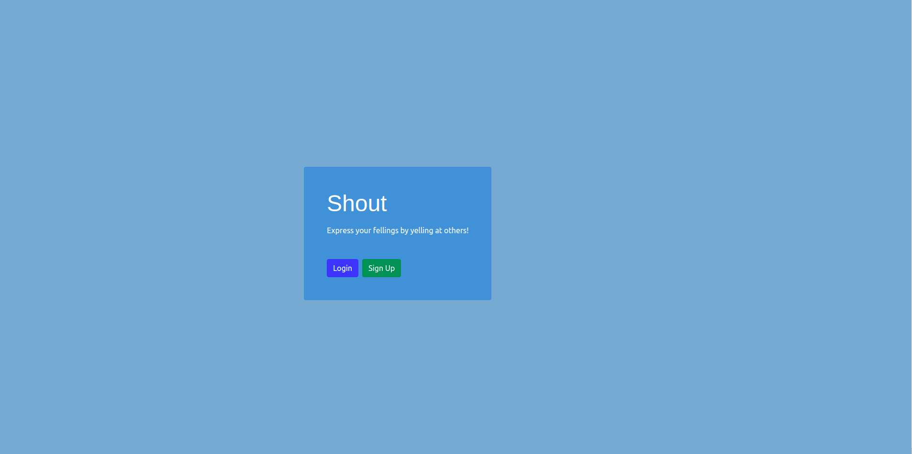
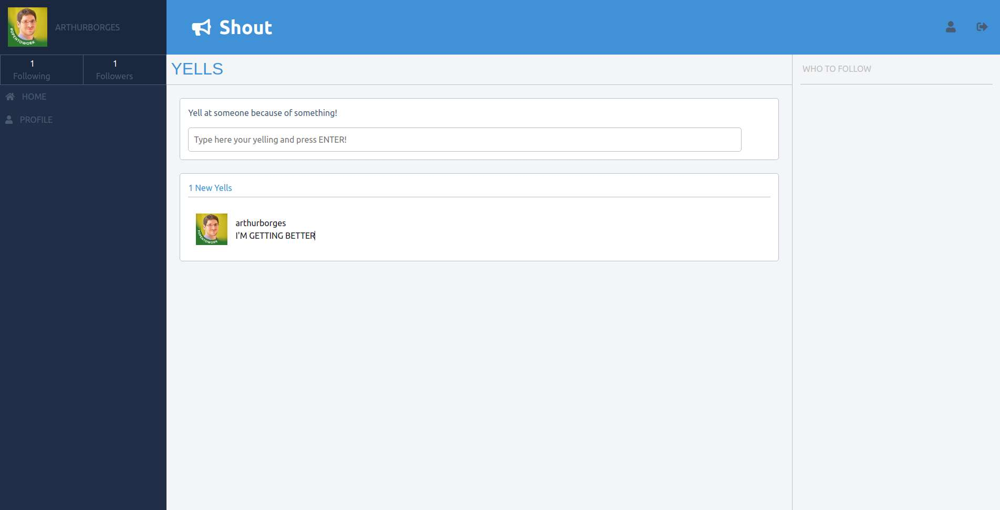
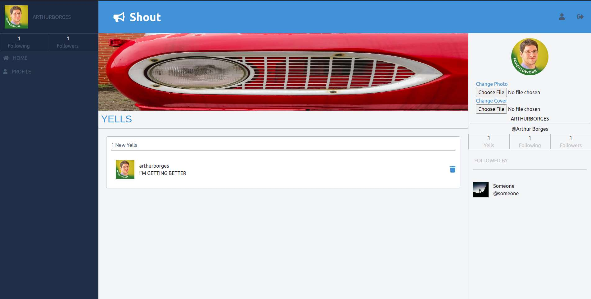

# Shout

> A Twitter-like app to shout/yell your problems because when you shout, you vent, and when you vent, you relax!

Additional description about the project and its features.

## Built With

- Git
- Github
- GitFlow
- VSCode
- Ruby 3
- Rails 6
- Rubocop
- Pinta
- Ubuntu 20.04
- Heroku 
- Postgres
- Cloudinary API
- ERB
- RSpec

## Live Demo

[Live Demo Link](https://afternoon-falls-84906.herokuapp.com/)

## Getting Started

To get a local copy up and running follow these simple example steps: 

`git clone git@github.com:arthurborgesdev/shout.git`

Now there are two main possibilities:

If the project is merged into main:

- Nothing to do, just proceed to the next step, `Prerequisites`

If the project is not merged into main (it is in the mvp-development phase)

- Create mvp-development branch by typing on a Terminal `git checkout -b mvp-development`
- Pull the project to this local branch with the command `git pull origin mvp-development` 
- Ok, now you have the project locally

### Prerequisites

- Ruby 3.x
- Ruby on Rails version 6.x
- Postgres installed (make sure to create databases `shout_development` and `shout_test`)
- Create a file named `.env` in the root of the project with the Cloudinary API KEYS:
  - CLOUDINARY_API_KEY='...'
  - CLOUDINARY_API_SECRET='...'

### Setup

- Run `bundle install` to install ruby and rails dependencies
- Run `yarn` to install the JS dependencies
- Run `rails db:migrate` to migrate the database

It may be necessary to run:

`rails webpacker:install`
`rails assets:clobber`  
`rails webpacker:compile`

To install webpacker and configure the pipeline of assets (Bootstrap + my stylesheet)   

### Usage

- On a separate terminal, run `rails s` to start the server
- Open a browser and access the url `localhost:3000`

### Run tests

To run the tests, run `rspec` or `bundle exec rspec` on a Terminal shell.

## Extra feature

The extra feature of this app is the possibility to remove yells on the userpage of the current logged user. Simple click the blue trash icon!

## Bootstrap and styles

On this project I installed bootstrap with webpacker (that's why my styles are in `app/frontend/packs/application.scss`)

For instructions to how I set it up, please visit [this link](https://bootrails.com/blog/rails-bootstrap-tutorial)

## Authors

👤 **Arthur Borges**

- GitHub: [@arthuborgesdev](https://github.com/arthurborgesdev)
- Twitter: [@arthurmoises](https://twitter.com/arthurmoises)
- LinkedIn: [Arthur Borges](https://linkedin.com/in/arthurmoises)

## 🤝 Contributing

Contributions, issues, and feature requests are welcome!

Feel free to check the [issues page](https://github.com/arthurborgesdev/shout/issues).

## Show your support

Give a ⭐️ if you like this project!

## Acknowledgments

- My mentor [@gscarv13](https://github.com/gscarv13)
- My Partner [@jmontanholi](https://github.com/jmontanholi)
- My friends
  - [@fernandorpm](https://github.com/fernandorpm)
  - [@pountzas](https://github.com/pountzas)
  - [@carlos-osorio-developer](https://github.com/carlos-osorio-developer)
  - [@Amalcxc](https://github.com/Amalcxc)
  - [@Takhmina175](https://github.com/Takhmina175)
- Default Cover Image by Jason Rosewell on Unsplash 
- Default Photo by Colton Sturgeon on Unsplash

  
